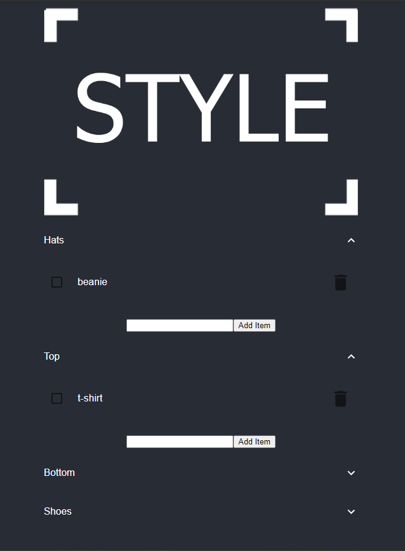

## Style
Categorize your shopping list by common articles of clothing: hats, tops, bottoms, and shoes.

Built using:

* [Firebase](https://firebase.google.com/) - Database
* [React](https://github.com/facebook/react) - UI with [Material UI](https://github.com/mui-org/material-ui)



## Install and run

Modify local copy of .env to utilize the app with a personal firebase real time database </br>

``` 
# Install packages
$ yarn install

# run on local host
$ yarn start
```
